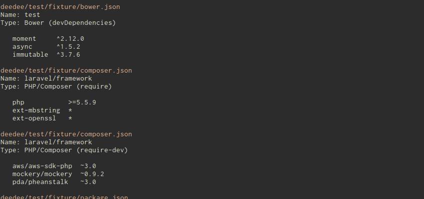

# deedee

[![Build Status][travis-image]][travis-url]
[![NPM Version][npm-image]][npm-url]
[![Coverage][coveralls-image]][coveralls-url]

Identifying all the dependencies used in a project can be difficult, especially
when they're spread out across many files and directories.

Deedee can locate dependencies for a variety of languages and produce a summary of the names of
those dependencies as well as their versions and other relevant information.

This information can help highlight a number of issues in projects, such as out-of-date
libraries, unused dependencies, and problems in package manifest files.



## Supports

- [x] Node.js
- [x] Bower
- [x] PHP (Composer)
- [ ] Inline `<script>` tags
- [ ] CSS `@import`
- [ ] Ruby
- [ ] Python
- [ ] Go
- [ ] ...

## Installation

```
$ npm install --save deedee
```

Or install it globally to use it from the command line:

```
$ npm install -g deedee
```

## Usage

The easiest way to use deedee is from the command line:

```
$ deedee path/to/some/awesome/project
```

You can also easily use it in a project:

```js
import path from 'path';
import deedee from '../lib/deedee.js';

deedee({
	path: path.resolve('..'),
	recursive: false
}).then(deps => {
	console.log(JSON.stringify(deps, null, 2));
});
```

## License

MIT © [Forrest Desjardins](https://github.com/fdesjardins)

[npm-url]: https://www.npmjs.com/package/deedee
[npm-image]: https://img.shields.io/npm/v/deedee.svg?style=flat
[travis-url]: https://travis-ci.org/fdesjasrdins/deedee
[travis-image]: https://img.shields.io/travis/fdesjardins/deedee.svg?style=flat
[coveralls-url]: https://coveralls.io/r/fdesjardins/deedee
[coveralls-image]: https://img.shields.io/coveralls/fdesjardins/deedee.svg?style=flat
